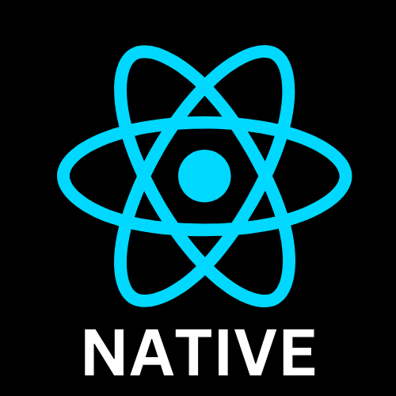

  <strong>Find me around: </strong>
  <a href='https://fullstacker.com.br' style='display: flex;align-items:center; gap:5px; min-width:120px;'>
    
    My website
  </a>

  <a href='https://linkedin.com/in/victor-kajiyama' style='display: flex;align-items:center; gap:5px'>
    
    My LinkedIn
  </a>

  <a href='mailto:victor.kajiyama@gmail.com' style='display: flex;align-items:center; gap:5px'>
    
    My E-mail
  </a>

🚀 Once upon a time in the land of web programming, I was thrown into the deep end, swimming with SQL sharks! 🦈 Working for companies where the business logic was like a secret society of stored procedures, triggers, views, and functions. And guess what? I fell head over heels for it! 🥰 For me, it was like playing a thrilling game of Sudoku or a strategic match of chess. 🎲🎮 I then embarked on a quest to learn ALL the things - Backend, Frontend,DevOPS, NOSQL - , and boy, was my brain thirsty! 🧠💦 But hey, I'm no programming superhero, so I had to pick my battles. Now, drumroll please... 🥁 Let me unveil my..

## Super-powers
### Programming Languages & some more...

  
  
  
  
  
  
  

### Frameworks & libs

  
  
  
  
  

### Tools & Techs

  
  
  
  

### Ongoing Learning

  

<Footer style='margin-top:40px;'>

  ###### Credits for the elements used here

  
  * Some icons were created by [FlatIcon](https://www.flaticon.com)

</Footer>
