

  <strong>Find me around: </strong>
  <a href='https://fullstacker.com.br' style='display: flex;align-items:center; gap:5px; min-width:120px;'>
    
    My website
  </a>

  <a href='https://linkedin.com/in/victor-kajiyama' style='display: flex;align-items:center; gap:5px'>
    
    My LinkedIn
  </a>

  <a href='mailto:victor.kajiyama@gmail.com' style='display: flex;align-items:center; gap:5px'>
    
    My E-mail
  </a>

My life with web programming started with a lot of SQL stuff to debug. I worked for companies where all the business logic was inside stored procedures, triggers, views, and functions - and man - I started to love that. For me, it was just like a quiz game - like Sudoku or chess. So then, I started learning everything that I could - and geez, it was a lot. Time passed and I decided to focus on something. I’m not the Rain Man in programming so I had to focus. Now - let me show you my…

## Super-powers
### Programming Languages

  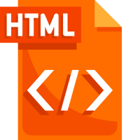
  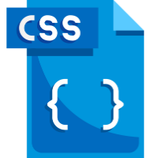
  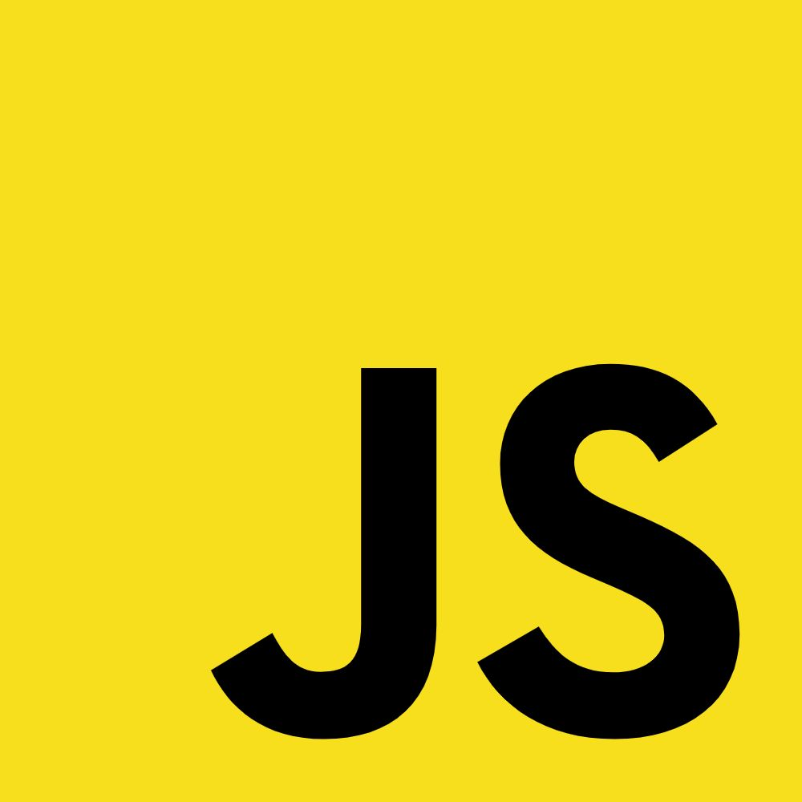
  
  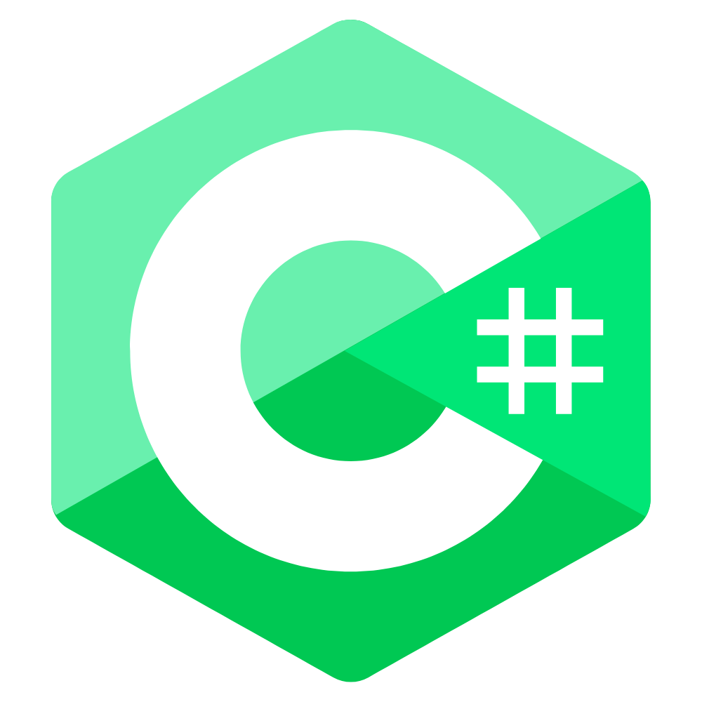
  
  

### Frameworks & libs

  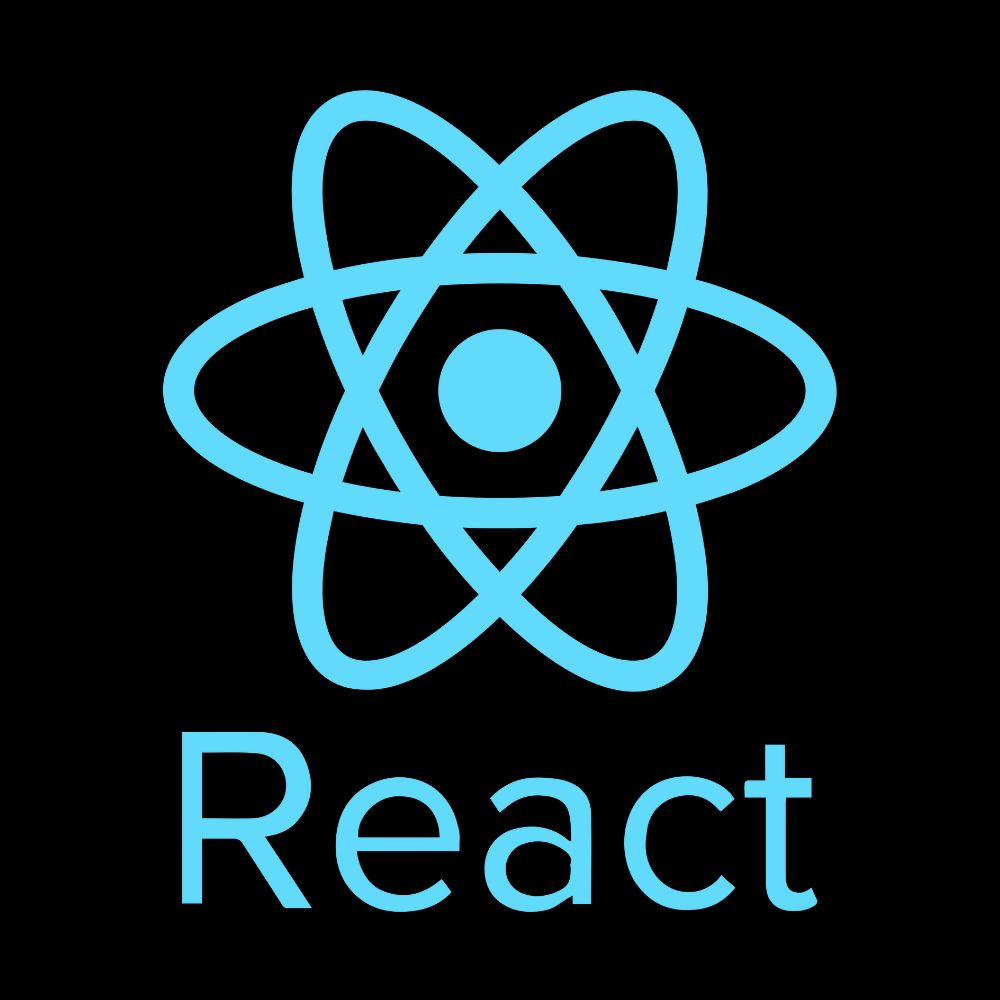
  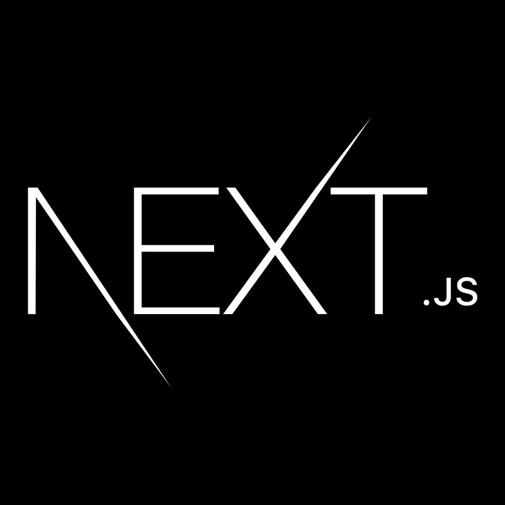
  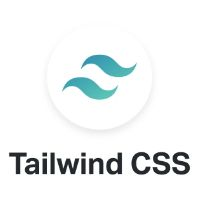
  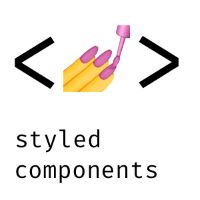
  

### Tools & Techs

  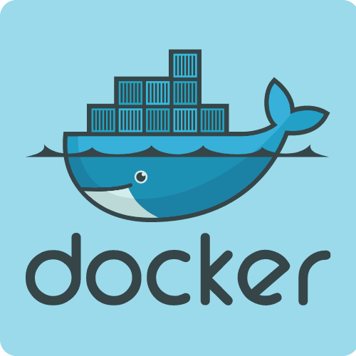
  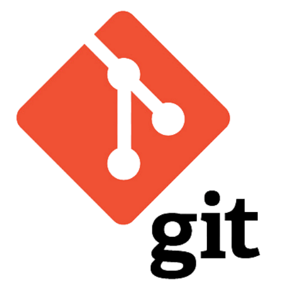
  
  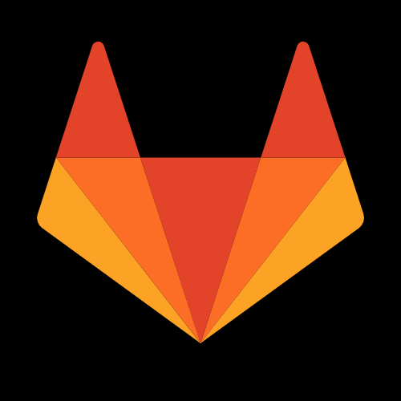

<Footer style='margin-top:40px;'>

  ###### Credits for the elements used here

  
  * Some icons were created by [FlatIcon](https://www.flaticon.com)

</Footer>