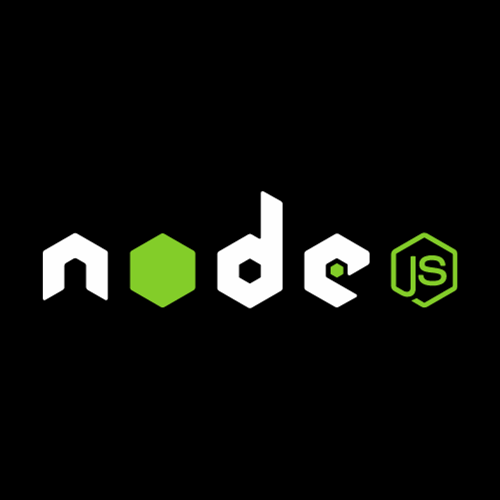

  <strong>Find me around: </strong>
  <a href='https://fullstacker.com.br' style='display: flex;align-items:center; gap:5px; min-width:120px;'>
    
    My website
  </a>

  <a href='https://linkedin.com/in/victor-kajiyama' style='display: flex;align-items:center; gap:5px'>
    
    My LinkedIn
  </a>

  <a href='mailto:victor.kajiyama@gmail.com' style='display: flex;align-items:center; gap:5px'>
    
    My E-mail
  </a>

🚀 Once upon a time in the land of web programming, I was thrown into the deep end, swimming with SQL sharks! 🦈 Working for companies where the business logic was like a secret society of stored procedures, triggers, views, and functions. And guess what? I fell head over heels for it! 🥰 For me, it was like playing a thrilling game of Sudoku or a strategic match of chess. 🎲🎮 I then embarked on a quest to learn ALL the things - Backend, Frontend,DevOPS, NOSQL - , and boy, was my brain thirsty! 🧠💦 But hey, I'm no programming superhero, so I had to pick my battles. Now, drumroll please... 🥁 Let me unveil my..

## Super-powers
### Programming Languages

  
  

    
    
<i>Javascript</i>

  

  

    
    
<i>Typescript</i>

  

  

    
    
<i>.NET C#</i>

  

  

    
    
<i>SQL</i>

  

  

    
    
<i>Python</i>

  

### Frameworks, libs & Others

  

    
    
<i>ReactJS</i>

  

  

    
    
<i>NextJS</i>

  

  

    
    
<i>NodeJS</i>

  

  

    
    
<i>Fastify</i>

  

  

    
    
<i>ExpressJS</i>

  

  
  

    

    
    
<i>RadixUI</i>

  

  

    
    
<i>TailwindCSS</i>

  

  

    
    
<i>Styled Components</i>

  

  

    
    
<i>Stitches</i>

  

  

    
    
<i>Jest</i>

  

  

    
    
<i>HTML</i>

  

  

    
    
<i>CSS</i>

  

### Tools & Techs

    
    
<i>SQL Server</i>

  

  

    
    
<i>Oracle</i>

  

  

    
    
<i>Docker</i>

  

  

    
    
<i>Git</i>

  

  

    
    
<i>Github</i>

  

  

    
    
<i>Gitlab</i>

  

### Ongoing Learning

  
  
<i>React Native</i>

<Footer style='margin-top:40px;'>

  ###### Credits for the elements used here

  
  * Some icons were created by [FlatIcon](https://www.flaticon.com)

</Footer>
